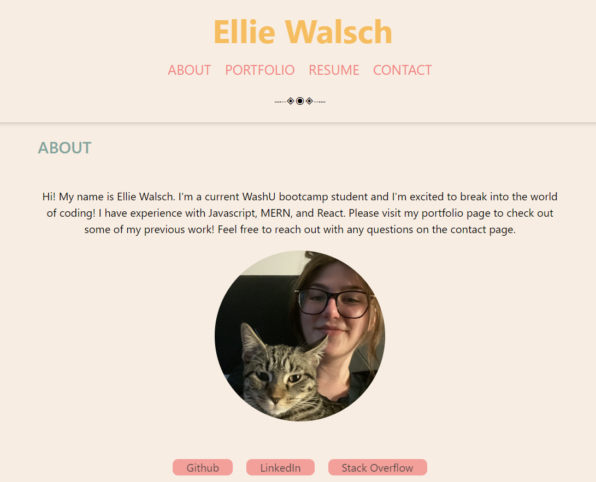

# React Portfolio

## Description

Welcome to my react portfolio! This is a rework of a previous assignment that uses React to conditionally render components.

## Installation

If you'd like to install this project, simply download the repo and run 'npm i' in the terminal. To run the app locally, run 'npm start' in the root directory.

## Usage

[Click here to visit my portfolio!](https://joyful-dusk-15c3a8.netlify.app/)

Please make sure to check out my portfolio and resume at the designated tabs. If you have any questions, feel free to reach out using the contact page!
